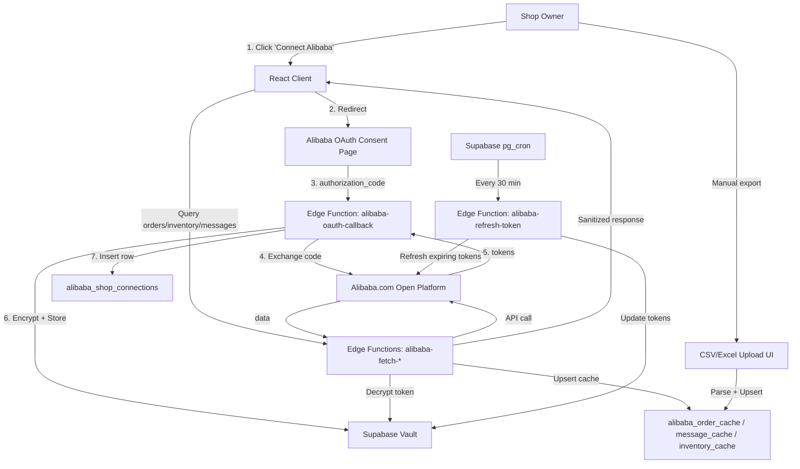

# [ADR-0001] Alibaba.com Open Platform Integration via OAuth

**Status:** Proposed
**Date:** 2026-04-13
**Author:** Solution Architect (@SA via @Atlas baseline)

---

## 1. Context & Problem Statement

`factory-finder-fashiongo` 사용자(소싱 매니저)는 거래 중인 Alibaba.com 상점에서 다음 정보를 확인해야 한다:

- **공개 정보**: 상품 카탈로그, 공장 메타데이터 (이미 `scrape-factory` Edge Function으로 부분 구현)
- **비공개 정보** (NEW): 주문 내역, 고객 메시지(TradeManager), 상세 재고 (창고/SKU 단위)

비공개 데이터는 상점 소유주 본인의 권한이 필요하므로, 스크래핑이나 자격증명 위탁 방식은 ToS 위반 + 보안 사고 위험이 크다. **상점 소유주의 OAuth 동의를 거쳐 Alibaba.com Open Platform 공식 API로 접근**하는 방식이 유일한 합법/안정 경로다.

본 ADR은 해당 통합의 아키텍처 결정과 단계별 구현 범위를 정의한다.

---

## 2. Architecture Drivers (Constraints)

### Functional
- 사용자가 자신의 Alibaba.com 상점을 우리 앱과 연결할 수 있어야 한다 (OAuth consent flow)
- 연결된 상점에서 주문 / 메시지 / 재고를 조회할 수 있어야 한다
- 토큰은 자동 갱신되어야 한다 (access_token 만료 시 refresh_token으로 재발급)
- 사용자는 언제든 연결을 해제할 수 있어야 한다 (token revoke + 캐시 삭제)
- 공식 API 장애 또는 앱 승인 지연 시를 위한 **CSV/Excel 업로드 fallback** 경로를 동일 데이터 모델로 제공한다

### Non-Functional
- **Security**: refresh_token은 평문 저장 금지. **Supabase Vault**로 암호화 보관
- **Privacy**: 비공개 데이터는 User-scoped RLS로 격리. 다른 사용자가 절대 접근 불가
- **Compliance**: Alibaba.com Open Platform 개발자 약관, rate limit, 데이터 보유 기간 준수
- **Resilience**: token refresh 실패 시 사용자에게 재연결 안내 (silent fail 금지)
- **Observability**: API 호출 로그, refresh 실패율, sync 지연시간을 추적할 수 있어야 한다

### Constitution (factory-finder-fashiongo `docs/constitution.md`)
- **Decision Flow Step 4 (Data source 선택)**: 외부 SaaS 통합은 **Edge Function**을 통해서만 호출 (refresh_token, app secret 등 비밀이 클라이언트로 새지 않도록)
- **Component Conventions Rule 5 (Hooks 위치)**: 새 통합의 클라이언트 훅은 `src/integrations/alibaba/hooks/`에 배치
- **State layer (Settings 패턴)**: 연결 상태는 React Query 캐시 + Supabase 영구 저장 hybrid 패턴 적용

---

## 3. The Decision (Solution Strategy)

### 3.1. Tech Stack
- **OAuth Provider**: Alibaba.com Open Platform (`open.alibaba.com`) — OAuth 2.0 Authorization Code grant
- **Token storage**: Supabase Vault (encrypted secrets), referenced by row in `alibaba_shop_connections` table
- **Server-side runtime**: Supabase Edge Functions (Deno) — handles OAuth callback, token refresh, all API calls
- **Client runtime**: React 18 + TanStack Query (5-min staleTime, optimistic update)
- **Cache layer**: Supabase tables (`alibaba_*_cache`) with TTL-based invalidation
- **Fallback ingestion**: CSV/Excel upload via existing `xlsx` library, dropping rows into the same cache tables

### 3.2. Pattern
**OAuth 2.0 + Server-side Token Vault + TTL Cache**
- Client never sees `client_secret`, `access_token`, or `refresh_token`
- Edge Function reads encrypted token from Supabase Vault, calls Alibaba API, returns sanitized response to client
- Cache tables persist last-known-good data so UI is responsive even if Alibaba API is slow/down

### 3.3. System Diagram

### 3.4. Data Model

| Table | Pattern | Purpose |
|-------|---------|---------|
| `alibaba_shop_connections` | User-scoped RLS | One row per (user_id, shop_id). Stores `vault_secret_id` reference, scopes, expires_at, last_refreshed_at, status. **No raw tokens in this table** |
| `alibaba_order_cache` | User-scoped RLS | Last-synced orders per shop. TTL 30 days, refreshed on demand |
| `alibaba_message_cache` | User-scoped RLS | Last-synced messages. TTL 7 days |
| `alibaba_inventory_cache` | User-scoped RLS | Last-known inventory snapshot per SKU. Refreshed on demand or via cron |
| Supabase Vault | Encrypted | Stores `access_token`, `refresh_token`, `client_secret` as named secrets |

### 3.5. Edge Functions

| Function | Trigger | Role |
|----------|---------|------|
| `alibaba-oauth-callback` | HTTP (Alibaba redirect) | Exchange `authorization_code` for tokens, encrypt to Vault, insert connection row |
| `alibaba-refresh-token` | pg_cron (every 30 min) | Refresh tokens within 1 hour of expiry |
| `alibaba-fetch-orders` | HTTP (client invoke) | Fetch order list, upsert cache, return sanitized data |
| `alibaba-fetch-messages` | HTTP (client invoke) | Fetch messages, upsert cache |
| `alibaba-fetch-inventory` | HTTP (client invoke) | Fetch inventory, upsert cache |
| `alibaba-disconnect` | HTTP (client invoke) | Revoke token at Alibaba, delete Vault secret + connection row + caches |
| `alibaba-csv-import` | HTTP (client invoke, multipart) | Parse uploaded CSV/Excel, upsert into cache tables under same schema |

---

## 4. Consequences

### Positive
- **Compliant**: 공식 OAuth 경로로 ToS 준수, 계정 정지 위험 없음
- **Secure**: 토큰이 클라이언트나 일반 DB 컬럼에 노출되지 않음 (Supabase Vault만 보관)
- **Resilient**: 캐시 테이블 + CSV fallback으로 외부 API 장애 시에도 UI 동작 가능
- **Composable**: 동일 데이터 모델을 OAuth와 CSV 두 경로가 공유 → 사용자가 어떤 경로로든 같은 화면 사용 가능
- **Extensible**: 추후 1688 / Taobao 추가 시 `platform` 컬럼만 분기, 같은 connection table 재사용

### Negative / Risks
- **앱 승인 지연**: Alibaba.com Open Platform 앱 등록 + 권한 스코프 승인이 수일~수주 소요. Sandbox 키로 선개발은 가능하지만 production 배포 일정 불확실 → CSV fallback이 critical path 보험
- **Rate limit**: Alibaba API 분당/일별 호출 제한. 대량 동기화 시 queue + backoff 필요. 미설계 시 connection 단위 throttling 누락 위험
- **Vault dependency**: Supabase Vault가 활성화되지 않은 프로젝트면 활성화 작업 선행 필요. Self-hosted Supabase 환경에서는 별도 검토 필요
- **Refresh token 만료**: refresh_token 자체에도 만료가 있음(통상 30일). cron 갱신 실패 시 사용자에게 재연결 요청해야 함 → UI에 명확한 status 노출 필요
- **메시지 동기화 복잡도**: 채팅 형태라 incremental sync(`since` parameter) 필수. 스레드 단위 머지 로직 설계 필요. **Phase 4로 후순위**
- **i18n / 시간대**: Alibaba API 응답이 중국 표준시 또는 UTC 혼재. cache 저장 시 UTC 정규화 필수

### Mitigations
- 앱 승인 지연 → Phase 1 인프라(OAuth 콜백 + 토큰 저장)는 Sandbox 키로 검증, CSV fallback 우선 출시 가능하도록 설계
- Rate limit → Edge Function 내부에 per-shop token bucket 도입 (간단 시작: connection 단위 동시성 1)
- Vault dependency → Phase 1.1 마이그레이션 첫 단계에서 `CREATE EXTENSION IF NOT EXISTS supabase_vault` 시도, 실패 시 즉시 사용자 안내
- Refresh token 만료 → `alibaba_shop_connections.status` 컬럼 (`active | refresh_required | revoked`)으로 상태 노출, UI에 재연결 배너

---

## 5. Requirements Breakdown (Hand-off to Tech Lead)

### Component A: `factory-finder-fashiongo` (frontend)
- **Role**: 연결 관리 UI, 데이터 조회 화면, CSV 업로드
- **Key Features to Build:**
    - [ ] `src/integrations/alibaba/client.ts` — Edge Function invoke 래퍼
    - [ ] `src/integrations/alibaba/types.ts` — Order / Message / Inventory 도메인 타입
    - [ ] `src/integrations/alibaba/hooks/use-alibaba-connection.ts` — 연결 상태 + connect mutation
    - [ ] `src/integrations/alibaba/hooks/use-alibaba-orders.ts`
    - [ ] `src/integrations/alibaba/hooks/use-alibaba-messages.ts`
    - [ ] `src/integrations/alibaba/hooks/use-alibaba-inventory.ts`
    - [ ] `src/integrations/alibaba/hooks/use-alibaba-csv-import.ts`
    - [ ] `src/pages/AlibabaSettings.tsx` — 연결/해제 UI, status 배너, CSV 업로드 폼
    - [ ] `src/components/alibaba/OrderList.tsx`, `MessageThread.tsx`, `InventoryTable.tsx`
    - [ ] Routes: `/settings/alibaba`, `/alibaba/orders`, `/alibaba/messages`, `/alibaba/inventory`
- **Special Instructions:** 모든 외부 API 호출은 Edge Function 경유. 클라이언트에 `client_secret`이나 토큰이 절대 노출되지 않아야 함

### Component B: `factory-finder-fashiongo` (Supabase backend)
- **Role**: OAuth 콜백 처리, 토큰 저장/갱신, API 호출 프록시, 캐시 관리
- **Key Features to Build:**
    - [ ] Migration: `alibaba_shop_connections` + 3개 cache 테이블 + RLS (User-scoped)
    - [ ] Migration: `pg_cron` job 등록 (`alibaba-refresh-token` 30분마다)
    - [ ] Edge Function: `alibaba-oauth-callback`
    - [ ] Edge Function: `alibaba-refresh-token`
    - [ ] Edge Function: `alibaba-fetch-orders`
    - [ ] Edge Function: `alibaba-fetch-messages`
    - [ ] Edge Function: `alibaba-fetch-inventory`
    - [ ] Edge Function: `alibaba-disconnect`
    - [ ] Edge Function: `alibaba-csv-import`
    - [ ] Shared lib: `supabase/functions/_shared/alibaba-vault.ts` — Vault read/write helper
    - [ ] Shared lib: `supabase/functions/_shared/alibaba-client.ts` — signed REST client with rate-limit + retry
- **Special Instructions:**
  - Vault secret 명명 규칙: `alibaba_token_<connection_id>` (delete 시 함께 삭제)
  - 모든 Edge Function은 `Authorization: Bearer <user_jwt>` 검증 후 RLS-aware client 사용
  - 외부 호출 실패 시 connection.status를 적절히 업데이트 후 사용자에게 명확한 에러 반환 (silent fail 금지)

### Component C: 외부 (사람 작업, 코드 아님)
- **Role**: Alibaba.com Open Platform 앱 등록, 권한 스코프 신청, Production 키 발급
- **Key Features to Deliver:**
    - [ ] Alibaba.com 개발자 계정 생성
    - [ ] 앱 생성, Sandbox 키 확보 (개발용)
    - [ ] 권한 스코프 신청: orders read, inventory read, messaging read
    - [ ] Production 승인 후 production 키 확보
    - [ ] Supabase Secrets에 `ALIBABA_CLIENT_ID`, `ALIBABA_CLIENT_SECRET`, `ALIBABA_REDIRECT_URI` 등록
- **Special Instructions:** 자세한 절차는 `docs/integrations/alibaba/phase-0-app-registration.md` 참조

---

## 6. Phase Roadmap

| Phase | Scope | Owner | Blocking? |
|-------|-------|-------|-----------|
| 0 | Alibaba 앱 등록 + 키 확보 + Supabase Vault 활성화 | Human (Component C) | Phase 2-4 차단 (Phase 1은 Sandbox로 진행 가능) |
| 1 | OAuth 인프라: connection table, OAuth callback, refresh, client hooks 골격, 연결 UI | @SWE | — |
| 2 | 주문 API + 캐시 + Order UI | @SWE | Phase 0 완료 필요 |
| 3 | 재고 API + 캐시 + Inventory UI | @SWE | Phase 0 완료 필요 |
| 4 | 메시지 API + 캐시 + Message UI (incremental sync) | @SWE | Phase 0 완료 필요 |
| 5 | CSV/Excel fallback (모든 도메인) | @SWE | — (Phase 1 완료 후 언제든 가능) |

---

*Generated: 2026-04-13 | Author: Solution Architect (collaborative output via Claude Code)*
